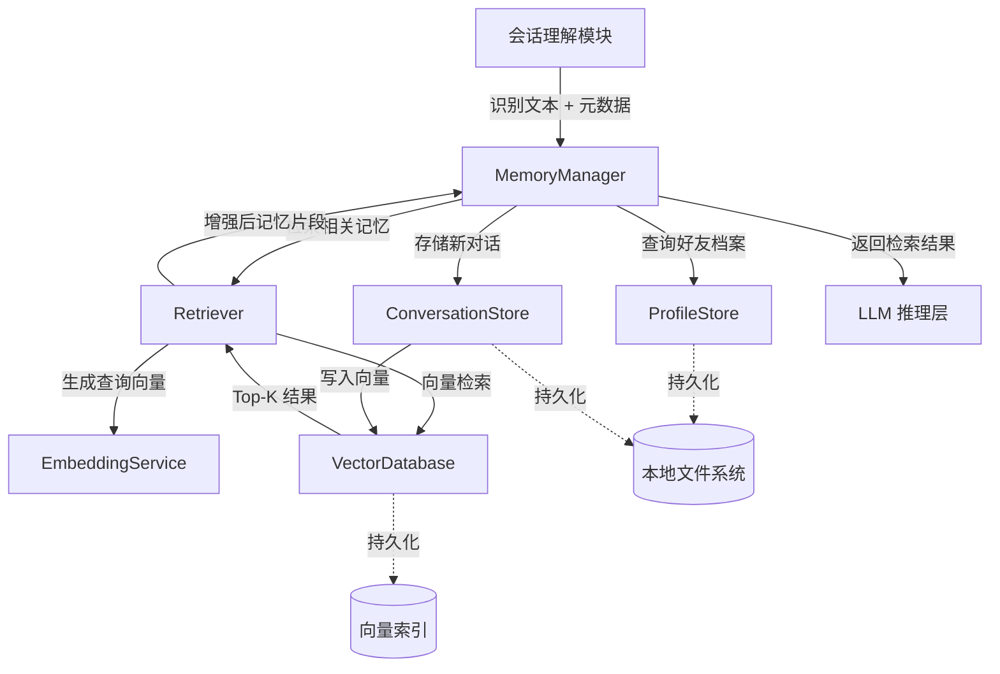

# 记忆与检索模块设计文档

## 1. 模块概述

### 1.1 模块定位

记忆与检索模块是 VRChat 社交辅助系统的核心智能组件，负责存储、管理和检索好友相关信息及对话历史，为 LLM 推理层提供上下文增强能力（RAG）。该模块通过向量化技术实现语义检索，帮助系统"记住"好友的偏好、兴趣和历史对话内容，从而生成更个性化、更贴合语境的社交建议。

### 1.2 核心价值

- **个性化辅助**：基于历史交互记录为每个好友提供差异化的对话建议
- **语境连贯性**：通过检索相关记忆片段，保持对话的连贯性和上下文感知
- **知识积累**：持续学习并积累好友的特征信息，随时间提升建议质量
- **隐私保护**：本地化存储与加密，确保用户数据安全

### 1.3 功能范围

**核心功能**：
- 好友档案的创建、读取、更新、删除（CRUD）
- 对话历史的存储与摘要生成
- 文本内容的向量化与索引构建
- 基于语义相似度的记忆检索（Top-K）
- 时间衰减与混合检索策略
- 记忆更新与过期清理

**边界说明**：
- 不包含声纹数据的存储（由说话人识别模块负责）
- 不包含原始音频的保存（仅保存文本摘要）
- 不包含 LLM 推理逻辑（仅提供检索结果）

## 2. 架构设计

### 2.1 模块结构

```
src/memory/
├── __init__.py                 # 模块导出
├── memory_manager.py           # 记忆管理器（核心协调者）
├── profile_store.py            # 好友档案存储
├── conversation_store.py       # 对话记录存储
├── vector_database.py          # 向量数据库封装
├── embedding_service.py        # 文本嵌入服务
├── retriever.py                # 检索器（检索策略实现）
└── models.py                   # 数据模型定义
```

### 2.2 组件协作流程



### 2.3 数据流向

**写入流程**：
1. 接收识别文本 + 说话人 ID + 时间戳
2. 查询或创建好友档案
3. 生成文本嵌入向量
4. 写入对话记录到 ConversationStore
5. 插入向量到 VectorDatabase
6. 可选：触发档案属性更新（如最后见面时间）

**检索流程**：
1. 接收查询上下文（当前对话文本）
2. 生成查询向量
3. 从 VectorDatabase 执行相似度检索
4. 应用时间衰减权重
5. 合并好友档案静态信息
6. 返回格式化的记忆片段列表

## 3. 核心组件设计

### 3.1 MemoryManager（记忆管理器）

**职责**：
- 统一的记忆操作入口
- 协调各子组件的交互
- 提供高层抽象接口
- 事务性操作保证数据一致性

**关键接口**：

| 方法名 | 输入参数 | 输出 | 说明 |
|--------|---------|------|------|
| `add_conversation` | `friend_id: str`, `transcript: str`, `speaker_id: str`, `timestamp: datetime`, `event_type: str`, `confidence: float` | `conversation_id: str` | 添加新对话记录 |
| `retrieve_memories` | `query: str`, `friend_id: Optional[str]`, `top_k: int`, `time_decay: bool` | `List[Memory]` | 检索相关记忆 |
| `get_friend_profile` | `friend_id: str` | `FriendProfile` | 获取好友档案 |
| `update_friend_profile` | `friend_id: str`, `updates: Dict` | `bool` | 更新好友档案属性 |
| `create_friend_profile` | `name: str`, `voice_profile_path: str`, `preferences: List[str]`, `avoid_topics: List[str]` | `friend_id: str` | 创建新好友档案 |
| `delete_all_memories` | `friend_id: Optional[str]` | `bool` | 删除记忆（隐私保护） |
| `generate_conversation_summary` | `friend_id: str`, `time_range: Tuple[datetime, datetime]` | `str` | 生成对话摘要 |

**数据一致性保证**：
- 写入操作使用事务机制（文件锁或数据库事务）
- 向量索引与元数据同步更新
- 异常回滚机制

### 3.2 ProfileStore（好友档案存储）

**职责**：
- 管理好友的静态与动态属性
- 提供档案的 CRUD 操作
- 支持按条件查询

**数据模型（FriendProfile）**：

```
好友档案结构：
{
  "id": "唯一标识符（UUID）",
  "name": "好友昵称（字符串）",
  "voice_profile_path": "声纹文件路径（字符串）",
  "preferences": ["兴趣爱好列表（字符串数组）"],
  "avoid_topics": ["禁忌话题列表（字符串数组）"],
  "personality": "性格标签（枚举：外向/内向/随和/活泼）",
  "language_preference": "语言偏好（zh/en/ja）",
  "custom_notes": "用户自定义备注（字符串，可空）",
  "last_seen": "最后交互时间（ISO 8601 时间戳）",
  "conversation_count": "对话次数（整数）",
  "created_at": "档案创建时间（ISO 8601 时间戳）",
  "updated_at": "档案更新时间（ISO 8601 时间戳）"
}
```

**存储方式**：
- 方案一：单文件 JSON（`data/profiles/friends.json`）
  - 优点：简单、易调试
  - 缺点：并发写入需加锁
- 方案二：每个好友一个文件（`data/profiles/{friend_id}.json`）
  - 优点：天然支持并发
  - 缺点：文件数量多

**推荐方案**：方案二（支持未来扩展）

**索引优化**：
- 维护内存缓存（LRU Cache，最多 100 个档案）
- 首次加载时构建 `name -> id` 映射

### 3.3 ConversationStore（对话记录存储）

**职责**：
- 存储对话的文本内容与元数据
- 支持按时间范围、好友 ID 查询
- 定期清理过期记录

**数据模型（Conversation）**：

```
对话记录结构：
{
  "id": "唯一标识符（UUID）",
  "friend_id": "好友ID（外键）",
  "timestamp": "对话时间（ISO 8601 时间戳）",
  "speaker_id": "说话人ID（区分自己/好友）",
  "transcript": "识别文本（字符串）",
  "event_type": "对话事件类型（枚举：QUESTION/STATEMENT/TOPIC_CHANGE）",
  "confidence": "识别置信度（浮点数，0-1）",
  "vector_id": "向量数据库中的ID（字符串，用于关联）",
  "summary": "摘要（可选，用于长对话压缩）"
}
```

**存储方式**：
- 方案一：SQLite 数据库
  - 优点：支持复杂查询、事务、索引
  - 缺点：引入额外依赖
- 方案二：按日期分片的 JSON 文件（`data/conversations/{friend_id}/{date}.json`）
  - 优点：轻量、可读性好
  - 缺点：查询性能较低

**推荐方案**：方案一（SQLite），适合数据量增长与复杂查询需求

**表结构设计**：

| 字段名 | 类型 | 约束 | 索引 |
|--------|------|------|------|
| id | TEXT | PRIMARY KEY | - |
| friend_id | TEXT | NOT NULL | ✓ |
| timestamp | DATETIME | NOT NULL | ✓ |
| speaker_id | TEXT | NOT NULL | - |
| transcript | TEXT | NOT NULL | - |
| event_type | TEXT | NOT NULL | - |
| confidence | REAL | NOT NULL | - |
| vector_id | TEXT | UNIQUE | ✓ |
| summary | TEXT | NULL | - |

**清理策略**：
- 保留最近 30 天的原始对话
- 30-90 天的对话保留摘要
- 90 天以上的对话可选择性删除或归档

### 3.4 VectorDatabase（向量数据库封装）

**职责**：
- 封装向量数据库的操作接口
- 支持向量的插入、检索、删除
- 管理索引的持久化与加载

**技术选型**：

| 方案 | 优点 | 缺点 | 推荐度 |
|------|------|------|--------|
| **Chroma** | 轻量级、Python原生、支持元数据过滤 | 性能一般（<10万条） | ★★★★★ |
| Faiss | 高性能、支持GPU加速 | 配置复杂、需单独管理元数据 | ★★★☆☆ |
| Milvus | 企业级、分布式 | 重量级、部署复杂 | ★☆☆☆☆ |

**推荐方案**：Chroma（适合 MVP 阶段，未来可迁移）

**关键接口**：

| 方法名 | 输入参数 | 输出 | 说明 |
|--------|---------|------|------|
| `initialize` | `persist_directory: str` | `None` | 初始化向量库 |
| `add_vectors` | `ids: List[str]`, `embeddings: List[List[float]]`, `metadatas: List[Dict]`, `documents: List[str]` | `None` | 批量插入向量 |
| `search` | `query_embedding: List[float]`, `top_k: int`, `filter: Optional[Dict]` | `List[SearchResult]` | 相似度检索 |
| `delete_by_id` | `ids: List[str]` | `None` | 删除指定向量 |
| `delete_by_filter` | `filter: Dict` | `int` | 按条件删除（返回删除数量） |
| `count` | `filter: Optional[Dict]` | `int` | 统计向量数量 |

**元数据结构**：
- `friend_id`: 好友 ID
- `timestamp`: 对话时间（Unix 时间戳）
- `speaker_id`: 说话人 ID
- `event_type`: 事件类型
- `conversation_id`: 对话记录 ID（关联 ConversationStore）

**持久化配置**：
- 索引保存路径：`data/vector_db/`
- 自动持久化间隔：每 100 次写入或每 5 分钟
- 启动时加载已有索引

### 3.5 EmbeddingService（文本嵌入服务）

**职责**：
- 将文本转换为向量表示
- 管理嵌入模型的加载与推理
- 支持批量处理提升效率

**模型选型**：

| 模型 | 维度 | 性能 | 语言支持 | 推荐度 |
|------|------|------|---------|--------|
| **bge-m3** | 1024 | 中等（CPU可用） | 中英日韩 | ★★★★★ |
| bge-small-zh-v1.5 | 512 | 快速 | 中英 | ★★★★☆ |
| text-embedding-ada-002 (OpenAI) | 1536 | 快速（API） | 多语言 | ★★★☆☆ |

**推荐方案**：bge-m3（本地化、多语言支持好）

**关键接口**：

| 方法名 | 输入参数 | 输出 | 说明 |
|--------|---------|------|------|
| `initialize` | `model_path: str`, `device: str` | `None` | 从本地路径加载模型 |
| `download_model` | `model_name: str`, `save_path: str`, `mirror: str` | `bool` | 下载模型到项目目录 |
| `encode` | `text: str` | `List[float]` | 单文本嵌入 |
| `batch_encode` | `texts: List[str]`, `batch_size: int` | `List[List[float]]` | 批量嵌入 |
| `get_dimension` | - | `int` | 获取向量维度 |
| `check_model_exists` | `model_path: str` | `bool` | 检查模型是否已下载 |

**性能优化**：
- 支持 GPU 加速（CUDA）
- 批量推理（batch_size=32）
- 模型缓存（常驻内存）
- 文本预处理（去除无效字符、截断长度）

**模型管理**：
- 首次启动检测：自动检查 `models/embeddings/bge-m3/` 是否存在
- 自动下载：如缺失且配置允许，从镜像源下载（优先使用 ModelScope 国内镜像）
- 下载进度提示：显示下载进度条与预计剩余时间
- 离线支持：软件安装包可预置模型文件，跳过下载步骤
- 模型校验：通过 MD5/SHA256 校验确保模型完整性

**文本规范化**：
- 最大长度：512 tokens（超出部分截断）
- 清洗规则：去除特殊字符、多余空格
- 语言检测：自动识别中英文混合

### 3.6 Retriever（检索器）

**职责**：
- 实现多种检索策略
- 对检索结果进行排序与过滤
- 应用时间衰减与权重调整

**检索策略**：

#### 3.6.1 语义检索（默认）

流程：
1. 将查询文本转换为向量
2. 从向量数据库检索 Top-K 相似结果
3. 按相似度评分排序

参数：
- `top_k`: 检索数量（默认 5）
- `similarity_threshold`: 相似度阈值（默认 0.6）

#### 3.6.2 混合检索（语义 + 关键词）

流程：
1. 语义检索获取候选集
2. 关键词匹配计算额外得分
3. 加权融合：`final_score = 0.7 * semantic_score + 0.3 * keyword_score`

适用场景：用户明确提到具体名词（如游戏名、地点）

#### 3.6.3 时间衰减检索

公式：
```
衰减后得分 = 原始得分 × decay_factor
decay_factor = exp(-λ × 时间差（天）)
```

参数：
- `λ (lambda)`: 衰减系数（默认 0.1）
  - λ=0.1：10 天后衰减至 37%
  - λ=0.05：20 天后衰减至 37%

适用场景：优先检索近期对话

#### 3.6.4 好友过滤检索

在向量检索时添加元数据过滤条件：
```
filter = {"friend_id": "target_friend_id"}
```

适用场景：只检索特定好友的记忆

**关键接口**：

| 方法名 | 输入参数 | 输出 | 说明 |
|--------|---------|------|------|
| `retrieve` | `query: str`, `friend_id: Optional[str]`, `top_k: int`, `strategy: str`, `apply_time_decay: bool` | `List[Memory]` | 通用检索接口 |
| `retrieve_recent` | `friend_id: str`, `days: int`, `limit: int` | `List[Memory]` | 检索最近 N 天记忆 |
| `retrieve_by_keyword` | `keywords: List[str]`, `friend_id: Optional[str]` | `List[Memory]` | 关键词检索 |

**返回结果（Memory）**：

```
记忆片段结构：
{
  "id": "记忆ID（字符串）",
  "content": "文本内容（字符串）",
  "friend_id": "好友ID（字符串）",
  "friend_name": "好友昵称（字符串）",
  "timestamp": "时间戳（ISO 8601）",
  "event_type": "事件类型（字符串）",
  "similarity_score": "相似度评分（浮点数，0-1）",
  "time_decay_factor": "时间衰减系数（浮点数，0-1）",
  "final_score": "最终得分（浮点数）"
}
```

## 4. 数据存储设计

### 4.1 目录结构

```
项目根目录/
├── data/                       # 用户数据
│   ├── profiles/               # 好友档案
│   │   ├── {friend_id_1}.json
│   │   ├── {friend_id_2}.json
│   │   └── ...
│   ├── conversations/          # 对话记录
│   │   └── conversations.db    # SQLite 数据库
│   ├── vector_db/              # 向量数据库
│   │   ├── chroma.sqlite3      # Chroma 索引
│   │   └── ...
│   └── cache/                  # 临时缓存
│       └── embeddings_cache.pkl # 嵌入向量缓存（可选）
├── models/                     # 模型文件（项目本地）
│   └── embeddings/             # 文本嵌入模型
│       └── bge-m3/             # bge-m3 模型目录
│           ├── config.json     # 模型配置
│           ├── pytorch_model.bin # 模型权重
│           ├── tokenizer.json  # 分词器
│           ├── vocab.txt       # 词表
│           └── model.safetensors # 安全张量格式（可选）
└── config/                     # 配置文件
    └── memory_config.yaml
```

### 4.2 数据备份与恢复

**备份策略**：
- 每日自动备份到 `data/backups/{date}/`
- 保留最近 7 天的备份
- 支持手动触发全量备份

**恢复流程**：
1. 停止写入操作
2. 从备份目录复制文件
3. 重新加载向量索引
4. 验证数据完整性

### 4.3 数据加密（可选）

**加密范围**：
- 好友档案 JSON 文件
- 对话记录数据库

**加密方案**：
- 算法：AES-256-GCM
- 密钥管理：用户设置主密码，派生加密密钥
- 性能影响：读写延迟增加 <10ms

**启用条件**：
- 用户在配置中启用隐私模式
- 提供密钥管理界面

## 5. 接口规范

### 5.1 对外 API

模块通过 `MemoryManager` 提供统一接口：

#### 添加对话记录

```
方法：add_conversation

输入参数：
- friend_id: 好友唯一标识符（字符串，必填）
- transcript: 识别的对话文本（字符串，必填）
- speaker_id: 说话人ID（字符串，必填，区分自己/好友）
- timestamp: 对话发生时间（datetime 对象，必填）
- event_type: 对话事件类型（字符串，可选值：QUESTION/STATEMENT/TOPIC_CHANGE/SILENCE）
- confidence: STT识别置信度（浮点数，0-1，默认0.9）

返回值：
- 对话记录的唯一ID（字符串）

异常：
- ValueError: 参数格式错误
- StorageError: 存储失败
```

#### 检索相关记忆

```
方法：retrieve_memories

输入参数：
- query: 查询文本（字符串，必填）
- friend_id: 限定好友ID（字符串，可选，为空则检索所有）
- top_k: 返回记忆数量（整数，默认5，范围1-20）
- time_decay: 是否应用时间衰减（布尔值，默认True）
- strategy: 检索策略（字符串，可选值：semantic/hybrid/keyword，默认semantic）

返回值：
- 记忆片段列表（List[Memory]），按最终得分降序排列

异常：
- ValueError: 参数格式错误
- RetrievalError: 检索失败
```

#### 获取好友档案

```
方法：get_friend_profile

输入参数：
- friend_id: 好友唯一标识符（字符串，必填）

返回值：
- FriendProfile 对象

异常：
- NotFoundError: 好友不存在
- StorageError: 读取失败
```

#### 更新好友档案

```
方法：update_friend_profile

输入参数：
- friend_id: 好友唯一标识符（字符串，必填）
- updates: 更新字段字典（Dict[str, Any]，必填）
  允许字段: name, preferences, avoid_topics, personality, custom_notes

返回值：
- 更新是否成功（布尔值）

异常：
- NotFoundError: 好友不存在
- ValueError: 更新字段不合法
- StorageError: 写入失败
```

#### 创建好友档案

```
方法：create_friend_profile

输入参数：
- name: 好友昵称（字符串，必填）
- voice_profile_path: 声纹文件路径（字符串，必填）
- preferences: 兴趣偏好列表（List[str]，可选，默认空列表）
- avoid_topics: 禁忌话题列表（List[str]，可选，默认空列表）
- personality: 性格标签（字符串，可选，默认"随和"）
- language_preference: 语言偏好（字符串，可选，默认"zh"）

返回值：
- 新创建的好友ID（字符串）

异常：
- ValueError: 参数格式错误
- DuplicateError: 同名好友已存在（可选检查）
- StorageError: 创建失败
```

#### 删除记忆

```
方法：delete_all_memories

输入参数：
- friend_id: 好友ID（字符串，可选，为空则删除所有记忆）
- confirm: 确认删除（布尔值，必填，防误操作）

返回值：
- 删除是否成功（布尔值）

异常：
- ValueError: 未确认删除
- StorageError: 删除失败
```

### 5.2 内部接口

各子组件间的接口定义：

#### ProfileStore 内部接口

- `_load_profile(friend_id: str) -> Dict`
- `_save_profile(friend_id: str, data: Dict) -> bool`
- `_list_all_ids() -> List[str]`

#### ConversationStore 内部接口

- `_execute_query(sql: str, params: Tuple) -> List[Dict]`
- `_insert_record(record: Dict) -> str`
- `_cleanup_old_records(days: int) -> int`

#### VectorDatabase 内部接口

- `_build_index(vectors: List[List[float]]) -> None`
- `_persist() -> None`
- `_load() -> None`

## 6. 配置管理

### 6.1 配置文件结构

```
配置文件路径: config/memory_config.yaml

配置项结构:
  storage:
    profiles_dir: "好友档案存储目录（字符串，默认data/profiles）"
    conversations_db: "对话数据库路径（字符串，默认data/conversations/conversations.db）"
    vector_db_dir: "向量数据库目录（字符串，默认data/vector_db）"
    backup_dir: "备份目录（字符串，默认data/backups）"
    enable_encryption: "是否启用加密（布尔值，默认false）"
  
  embedding:
    model_name: "嵌入模型名称（字符串，默认BAAI/bge-m3）"
    model_path: "模型本地路径（字符串，默认models/embeddings/bge-m3）"
    device: "运行设备（字符串，可选cuda/cpu，默认cuda）"
    batch_size: "批处理大小（整数，默认32）"
    max_length: "文本最大长度（整数，默认512）"
    auto_download: "首次运行是否自动下载模型（布尔值，默认true）"
    download_mirror: "下载镜像源（字符串，可选huggingface/modelscope，默认modelscope）"
  
  vector_db:
    backend: "向量库后端（字符串，可选chroma/faiss，默认chroma）"
    persist_interval: "持久化间隔（整数，单位秒，默认300）"
    dimension: "向量维度（整数，自动从模型获取）"
  
  retrieval:
    default_top_k: "默认检索数量（整数，默认5）"
    similarity_threshold: "相似度阈值（浮点数，0-1，默认0.6）"
    time_decay_lambda: "时间衰减系数（浮点数，默认0.1）"
    enable_time_decay: "是否启用时间衰减（布尔值，默认true）"
    default_strategy: "默认检索策略（字符串，默认semantic）"
  
  cleanup:
    retention_days: "对话保留天数（整数，默认30）"
    summary_retention_days: "摘要保留天数（整数，默认90）"
    auto_cleanup_enabled: "是否自动清理（布尔值，默认true）"
    cleanup_interval_hours: "清理间隔（整数，单位小时，默认24）"
  
  cache:
    enable_profile_cache: "是否启用档案缓存（布尔值，默认true）"
    max_cache_size: "最大缓存数量（整数，默认100）"
    embedding_cache_enabled: "是否缓存嵌入向量（布尔值，默认false）"
```

### 6.2 配置加载与验证

**加载流程**：
1. 读取 YAML 配置文件
2. 合并默认配置
3. 验证参数范围与类型
4. 应用到各组件

**验证规则**：
- `top_k`: 1-20
- `similarity_threshold`: 0.0-1.0
- `time_decay_lambda`: 0.01-1.0
- 路径合法性检查
- 设备可用性检查（CUDA）

## 7. 性能指标

### 7.1 响应时间目标

| 操作 | 目标延迟 | 最大可接受 |
|------|---------|----------|
| 添加对话（含嵌入） | 50ms | 100ms |
| 检索 Top-5 记忆 | 30ms | 80ms |
| 获取好友档案 | 5ms | 20ms |
| 更新好友档案 | 10ms | 30ms |
| 批量嵌入（32条） | 200ms | 500ms |

### 7.2 容量规划

**预期数据规模（单用户）**：
- 好友数量：10-50 人
- 每日对话量：100-500 条
- 年对话总量：~10 万条
- 向量数据库大小：~500 MB（含索引）

**性能测试指标**：
- 10 万条记录下检索延迟 <50ms
- 100 个好友档案加载 <100ms
- 数据库写入吞吐量 >200 条/秒

### 7.3 资源占用

- 内存：
  - 嵌入模型：~1.5 GB（bge-m3）
  - 向量索引（10万条）：~400 MB
  - 档案缓存：~10 MB
  - 总计：~2 GB

- 磁盘：
  - 嵌入模型（一次性）：~2 GB
  - 向量数据库：~500 MB/年
  - 对话记录：~200 MB/年
  - 备份：~700 MB（7天）
  - 总计首次安装：~3.5 GB

## 8. 异常处理

### 8.1 异常分类

**存储异常（StorageError）**：
- 磁盘空间不足
- 文件权限错误
- 数据库锁定
- 数据损坏

处理策略：
- 重试机制（最多 3 次）
- 降级到只读模式
- 记录详细错误日志
- 用户通知

**检索异常（RetrievalError）**：
- 向量库未初始化
- 模型加载失败
- 查询超时

处理策略：
- 返回空结果并记录警告
- 降级到关键词检索
- 自动重新初始化

**数据异常（ValidationError）**：
- 参数类型错误
- 数据格式不合法
- 必填字段缺失

处理策略：
- 立即抛出异常
- 返回详细错误信息
- 不进行任何写入操作

### 8.2 降级策略

**场景一：嵌入模型不可用**
- 降级方案：使用预计算的关键词匹配
- 影响：检索质量下降，但功能可用

**场景二：向量库损坏**
- 降级方案：从备份恢复或重建索引
- 影响：服务短暂中断（<1分钟）

**场景三：磁盘空间不足**
- 降级方案：停止新记录写入，只读模式
- 影响：无法保存新对话，但可检索历史

### 8.3 日志记录

**日志级别**：
- DEBUG：检索查询详情、向量维度
- INFO：档案创建/更新、数据库操作
- WARNING：检索结果为空、模型加载慢
- ERROR：存储失败、数据损坏
- CRITICAL：数据库无法访问、模型加载失败

**日志格式**：
```
时间戳 | 级别 | 模块 | 操作 | 详情
示例：
2025-11-24 10:30:15 | INFO | MemoryManager | add_conversation | friend_id=abc123, conversation_id=xyz789
2025-11-24 10:30:16 | ERROR | VectorDatabase | search | 向量库查询超时: timeout=5s
```

**日志存储**：
- 路径：`logs/memory_module.log`
- 轮转策略：每日轮转，保留 30 天
- 大小限制：单文件最大 50 MB

## 9. 测试策略

### 9.1 单元测试

**覆盖范围**：
- ProfileStore：CRUD 操作、并发写入
- ConversationStore：查询、时间过滤
- VectorDatabase：插入、检索、删除
- EmbeddingService：文本编码、批量处理
- Retriever：各检索策略、排序逻辑

**测试工具**：pytest

**测试数据**：
- Mock 数据生成器
- 固定测试集（10 个好友档案、100 条对话）

### 9.2 集成测试

**测试场景**：
1. 完整写入-检索流程
2. 大规模数据导入（10万条）
3. 并发读写
4. 备份恢复
5. 异常恢复（模拟数据库损坏）

**性能基准**：
- 检索延迟 <50ms（P95）
- 写入吞吐量 >200 条/秒
- 内存占用 <2.5 GB

### 9.3 端到端测试

**测试流程**：
1. 创建好友档案
2. 模拟连续对话（50 轮）
3. 每轮检索相关记忆
4. 验证检索结果相关性
5. 检查数据持久化

**验证指标**：
- 检索相关性（人工评估 >80%）
- 数据一致性（无丢失）
- 性能稳定性（延迟无异常抖动）

## 10. 安全与隐私

### 10.1 数据隐私保护

**最小化原则**：
- 不保存原始音频
- 对话文本定期摘要压缩
- 敏感信息（联系方式、地址）自动脱敏

**用户控制**：
- 提供一键删除所有记忆功能
- 支持按好友删除记忆
- 支持暂停记忆功能（只检索不保存）

**访问控制**：
- 数据文件仅限当前用户读写
- 可选主密码保护
- 加密存储敏感字段

### 10.2 数据加密

**加密范围**（隐私模式启用时）：
- 好友档案中的 `custom_notes` 字段
- 对话记录的 `transcript` 字段
- 向量数据库的元数据

**加密流程**：
1. 用户设置主密码
2. 使用 PBKDF2 派生 AES-256 密钥
3. 对敏感字段逐一加密
4. 存储时附带 IV（初始化向量）
5. 读取时自动解密

**密钥管理**：
- 密钥不存储在磁盘
- 应用启动时要求输入主密码
- 会话期间保留在内存

### 10.3 合规性

**数据出境**（如使用在线嵌入服务）：
- 明确告知用户数据将发送到第三方 API
- 提供本地化替代方案
- 脱敏处理后再发送

**数据留存**：
- 默认保留 30 天原始对话
- 超期自动清理或归档
- 用户可自定义留存策略

## 11. 扩展性设计

### 11.1 模块化插件

**支持自定义检索策略**：
- 定义检索器接口
- 允许注册自定义 Retriever 实现
- 配置文件指定使用的策略

**支持多向量库后端**：
- 抽象 VectorDatabase 基类
- 实现 ChromaBackend、FaissBackend
- 通过配置切换

### 11.2 分布式扩展（未来）

**场景**：支持云同步或多设备共享记忆

**方案**：
- 使用 Milvus 替代 Chroma
- 部署中心化向量服务
- 客户端通过 API 访问

### 11.3 多模态记忆（未来）

**场景**：存储图像、视频片段（如 VR 场景截图）

**方案**：
- 扩展数据模型支持 `media_type` 字段
- 使用 CLIP 等模型生成多模态嵌入
- 统一检索接口

## 12. 开发计划

### 12.1 Phase 1：基础框架（1 周）

**任务清单**：
- [ ] 定义数据模型（FriendProfile、Conversation、Memory）
- [ ] 实现 ProfileStore（文件存储）
- [ ] 实现 ConversationStore（SQLite）
- [ ] 搭建 VectorDatabase 封装（Chroma）
- [ ] 实现 EmbeddingService 模型下载与管理
- [ ] 集成 EmbeddingService（bge-m3，本地加载）
- [ ] 实现 MemoryManager 基础接口
- [ ] 编写单元测试（覆盖率 >80%）

**验收标准**：
- 可以创建好友档案并持久化
- 可以添加对话并生成向量
- 可以执行基础的相似度检索
- 模型自动下载与本地加载功能正常

### 12.2 Phase 2：检索优化（3 天）

**任务清单**：
- [ ] 实现 Retriever 的多策略支持
- [ ] 实现时间衰减算法
- [ ] 实现混合检索（语义+关键词）
- [ ] 添加结果排序与过滤逻辑
- [ ] 性能测试（10万条数据）
- [ ] 编写集成测试

**验收标准**：
- 检索延迟 <50ms（P95）
- 支持按好友 ID 过滤
- 时间衰减正确生效

### 12.3 Phase 3：功能完善（3 天）

**任务清单**：
- [ ] 实现对话摘要生成（调用 LLM）
- [ ] 实现数据清理策略
- [ ] 实现备份与恢复功能
- [ ] 添加配置文件支持
- [ ] 实现日志记录
- [ ] 添加异常处理与降级逻辑
- [ ] 编写端到端测试

**验收标准**：
- 自动清理过期对话
- 支持从备份恢复
- 异常场景不影响其他功能

### 12.4 Phase 4：隐私增强（可选，2 天）

**任务清单**：
- [ ] 实现数据加密（AES-256）
- [ ] 实现主密码管理
- [ ] 添加一键删除功能
- [ ] 敏感信息脱敏
- [ ] 安全审计日志

**验收标准**：
- 启用加密后数据不可明文读取
- 删除功能清除所有相关数据
- 性能影响 <10%

## 13. 依赖项

### 13.1 Python 依赖

```
核心依赖（requirements.txt）:
  - chromadb>=0.4.0         # 向量数据库
  - sentence-transformers>=2.2.0  # 文本嵌入
  - numpy>=1.24.0           # 数值计算
  - pyyaml>=6.0             # 配置文件解析
  - pydantic>=2.0           # 数据验证
  
可选依赖:
  - faiss-cpu>=1.7.0        # 备选向量库（CPU版本）
  - cryptography>=41.0      # 加密功能
```

### 13.2 系统依赖

- Python 3.10+
- SQLite 3.35+（内置于 Python）
- CUDA 11.8+（GPU 加速，可选）

### 13.3 模型依赖

**嵌入模型**：
- 模型名称：BAAI/bge-m3
- 存储位置：`models/embeddings/bge-m3/`（项目目录内）
- 磁盘空间：~2 GB
- 下载方式：
  - **方式一**：首次运行时自动从 ModelScope（国内镜像）下载
  - **方式二**：使用预置模型的离线安装包
  - **方式三**：手动下载后放置到指定目录
- 下载地址：
  - ModelScope（推荐）: `https://modelscope.cn/models/Xorbits/bge-m3`
  - HuggingFace: `https://huggingface.co/BAAI/bge-m3`

**模型管理流程**：
1. 软件启动时检查 `models/embeddings/bge-m3/config.json` 是否存在
2. 如不存在且 `auto_download=true`，显示下载确认对话框
3. 用户确认后从 ModelScope 镜像下载（国内速度更快）
4. 下载完成后进行 SHA256 校验
5. 校验通过后初始化模型并标记为可用
6. 后续启动直接从本地加载，无需重复下载

**本地存储路径**（项目内）：
- 模型文件：`models/embeddings/bge-m3/`
- 配置文件：`models/embeddings/bge-m3/config.json`
- 权重文件：`models/embeddings/bge-m3/pytorch_model.bin`

**存储策略**：
- 所有模型文件存储在项目目录下，避免用户系统缓存冲突
- 软件首次运行时自动检测并下载模型到项目目录
- 提供离线安装包（预置模型文件）
- 用户无需手动管理模型路径
